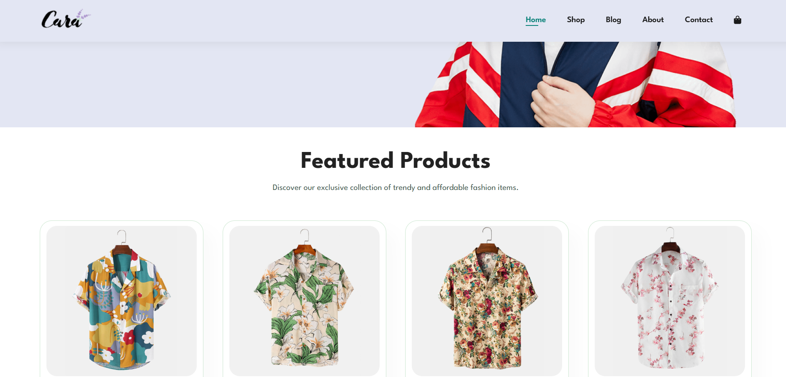
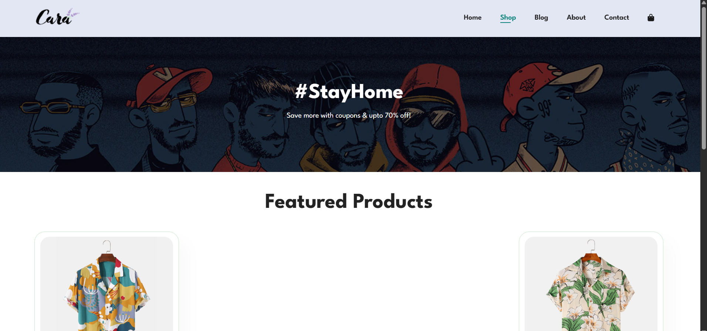
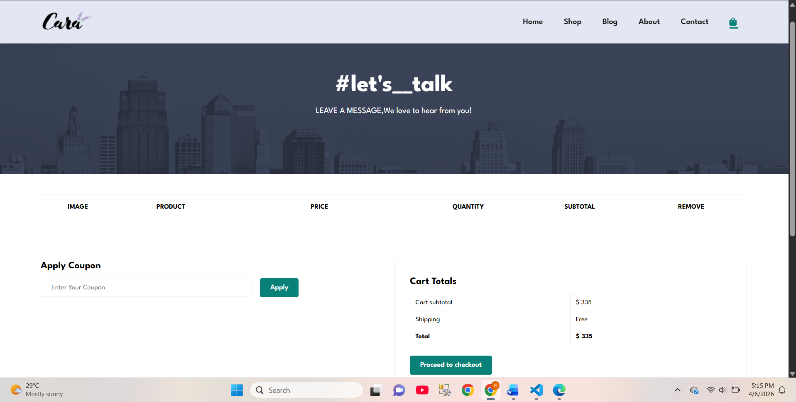

# 🛍️ Cara — Fashion E-Commerce Website

A fully responsive multi-page fashion e-commerce website with a working shopping cart, product pages, blog, contact form with Google Maps, and mobile navigation — built with HTML, CSS, and JavaScript.

---

## ✨ Features

- **Multi-page Website** — Home, Shop, Product Details, Cart, Blog, About, Contact
- **Working Shopping Cart** — Add, remove, and update product quantities with localStorage persistence
- **Dynamic Product Details** — URL-based product loading using query parameters
- **Sticky Navigation** — Header stays visible while scrolling
- **Mobile Hamburger Menu** — Slide-in navbar for smaller screens
- **Hero Section** — Full-viewport banner with call-to-action
- **Featured & New Arrivals** — Product grids with star ratings
- **Promotional Banners** — Multiple banner sections with background images
- **Blog Section** — Article cards with continue reading links
- **About Page** — Company story with autoplay video
- **Contact Page** — Contact form + Google Maps embed + team members
- **Newsletter Signup** — Email subscription form in footer
- **Payment Gateway Icons** — App Store, Google Play, and payment badges
- **Fully Responsive** — Mobile, tablet, and desktop layouts

---

## 🛠️ Built With

- HTML5
- CSS3 (Flexbox, media queries, transitions)
- Vanilla JavaScript (localStorage, DOM manipulation, URL params)
- Font Awesome 6 (icons)
- Google Fonts (League Spartan)

---

## 📁 Project Structure

```
Shopping-Website/
├── index.html          (Home page)
├── shop.html           (Shop / product listing)
├── product-details.html (Single product page)
├── cart.html           (Shopping cart)
├── blog.html           (Blog articles)
├── about.html          (About us)
├── contact.html        (Contact + map)
├── style.css
├── script.js           (Navigation + cart logic)
├── products.js         (Product data)
├── cart.js             (Cart rendering)
└── img/
    ├── logo.png
    ├── hero4.png
    ├── button.png
    ├── products/       (f1-f8.jpg, n1-n8.jpg)
    ├── banner/         (b1-b19.jpg)
    ├── blog/           (b1-b6.jpg)
    ├── about/          (a6.jpg, banner.png, 1.mp4)
    ├── people/         (1-3.png)
    └── pay/            (app.jpg, play.jpg, pay.png)
```

---

## 🚀 How to Run Locally

1. Clone the repository:
   ```bash
   git clone https://github.com/Rabia-1275/shopping-website.git
   ```

2. Open the project folder:
   ```bash
   cd shopping-website
   ```

3. Open `index.html` in your browser — no installation needed.

---

## 🛒 Cart Functionality

- Products are stored in `localStorage` so cart persists on page refresh
- Add items from the Shop page using "Add to Cart" buttons
- View, update quantity, and remove items on the Cart page
- Cart total is calculated dynamically

---

## 🌐 Live Demo

> 🔗 [View Live Project](#) *(https://rabia-1275.github.io/Shopping/)*

---

## 📸 Screenshots

| Home | Shop | Cart |
|------|------|------|
|  |  |  |

---

## 🎯 What I Learned

- Building a complete multi-page website with consistent navigation
- Implementing localStorage for cart state persistence
- Loading dynamic product data using URL query parameters
- Creating responsive layouts with CSS Flexbox and media queries
- Building a mobile slide-in navigation menu with JavaScript
- Embedding Google Maps and working with iframes
- Managing multiple JS files (script.js, products.js, cart.js)

---

## 👩‍💻 Author

**Rabia Naseer**
- GitHub: [@Rabia-1275](https://github.com/Rabia-1275)
- LinkedIn: [Rabia Naseer](https://www.linkedin.com/in/rabia-naseer-33421a307)

---